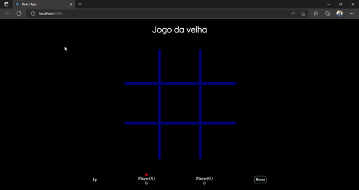

## Jogo da Velha

O jogo da velha ou jogo do galo ou três em linha é um jogo e/ou passatempo popular. É um jogo de regras extremamente simples, que não traz grandes dificuldades para seus jogadores e é facilmente aprendido.

### Preview

[Clique Aqui](https://willowy-lily-45ee0a.netlify.app)

### Tecnologias

- React JS
- JavaScript
- JSX
- Styled Components
- Yarn - Package Manager
